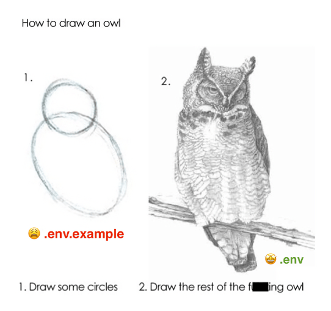
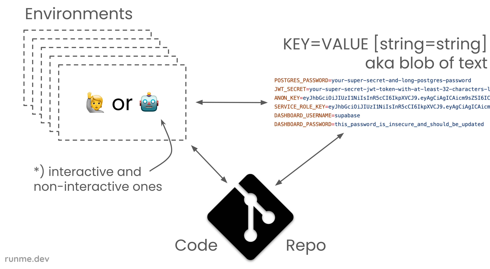
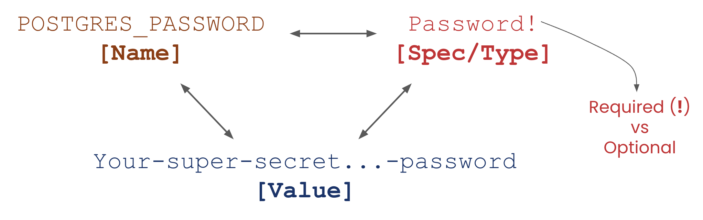

# The Owl Store 🦉

### What is it?



## A ENV solution for Humans **and** Workloads:

- Specify, Validate, and Resolve ENV vars
- Verification of “Correctness” & better tools

## Took inspiration from

- The SSH-Agent
- How Typescript brings type-safety to Javascript

## Why?

- Make idea of "SSO for your Environments" come to live
- The 🦉 knows best, because she's the wisest of birds in the animal kingdom

Learn more: [Typed Environment Variables](https://runme.dev/blog/typed-env-vars)

## Environment “Specs”

The **.env.example** frontend/facade:

```ini {"id":"01HS8C1PN0T7BGJA0T6TT2G68R","interpreter":"cat"}
JWT_SECRET=Secret to sign authed JWT tokens # Secret!
ANON_KEY=Secret to sign anonymous JWT tokens # Secret!
SERVICE_ROLE_KEY=JWT to assume the service role # JWT
POSTGRES_PASSWORD=Password for the postgres user # Password!
DASHBOARD_USERNAME=Username for the dashboard # Plain!
DASHBOARD_PASSWORD=Password for the dashboard # Password!
SOME_OTHER_VAR=Needs a matching value # Regex(/^[a-z...a. -]+\.)
```

### Philosophy

- Composable, extensible, and progressive
- Queryable resolution thanks to Graph (DAG)
- Use Auth-Context, Machine & Runtime info, etc
- Connect to SOPS, Secret Managers, CLI tools etc
- E.g. different resolution paths per ENV class
- OWL easily better three letter acronym than ENV
- .env files on outside - Graph Engine on inside
- Progressive: use as much or little as you need
- Different facades possible e.g. CRDs, YAML-dialect, SDKs
- Runme’s fallback resolution → “securely prompt user”
- Get involved, help building out owl toolkit & ecosystem

## Define ENV spec inside code repository



## Anatomy of Environment Vars ⇄ “Specs”



## Extensible at every stage

### Development CUE catalog override

Owl binaries validate built-in types with an embedded CUE catalog. Developers
and deployment packagers can replace those validation definitions with a
complete directory-backed Owl CUE module by setting `OWL_CUE_ROOT`:

```sh
OWL_CUE_ROOT=/absolute/path/to/owl owl check
```

Relative paths resolve from the Owl process working directory. The directory
must contain the complete built-in `cue.mod`, `schema`, and `types` trees; an
empty, missing, incomplete, or invalid override fails the command instead of
falling back to embedded definitions.

`OWL_CUE_ROOT` is a developer/deployment control, not project configuration or
a custom-type frontend. It changes CUE validation only: Owl continues to own
the known built-in type metadata, sensitivity rules, and dotenv projection
conventions in Go. The control variable itself is excluded from observed
environment-store values.

#### Resolution (e.g. translated `env.owl.yaml` or JS/Golang/Java/etc SDKs)

```graphql {"id":"01HSXDJ4HAGVVT62961TK2NTBT","interpreter":"cat"}
query ResolveEnv(...) {
   ...
   render {
      withCell(ulid: "01HRA297WC2HJP7X48FM3DR1V0") {
         withShell(command: "terraform output -json | jq -r .workspace_vars.value.{}") {
            command
            withWebhook(url: "https://secrets.platform.runme.dev/resolver") {
               url
               withStateful(org: "acme-corp") {
                  org
                  dotenv(prefix: "VITE_REACT_APP_", export: false)
                  snapshot {
                     ...
                  }
               }
            }
         }
      }
   }
}
```

#### .env-Frontend (query ASTs rendered in text for illustration)

```graphql {"id":"01HSXDR2PDVFZ9ZV8Z60XK6MTB","interpreter":"cat"}
query LoadDotEnvs {
    process {
        path
        file(paths: ["env.spec", ".env.example"], ignoreSpecs: false) {
            path
            file(paths: [".env.local", ".env"]) {
                path
                vars
                specs
            }
        }
    }
}
```

## Common set of Specs (not all available yet)

- Plain

   - Opaque
   - Regex(...)
   - ...

- Secret

   - Password
   - JWT
   - x509Cert
   - ...

- Resources

   - DbUrl
   - Redis
   - ...

- Cred Sets (non-atomic)

   - FirebaseSdk
   - OpenAI
   - ...
