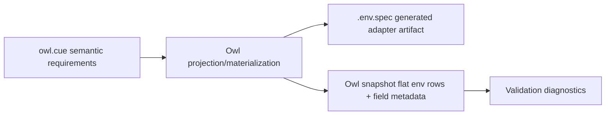

# Composite Requirements

## Goal

Owl should model higher-level environment requirements without making `.env.spec` carry the full semantic model.

The first composite requirement is Redis:

- `host`
- `port`
- `password`

More Redis shape (`username`, `db`, `tls`, URI normalization, sentinel, cluster) is deferred.

## Flow



## Type References

Type references are import-path-like refs that resolve to CUE definitions in a git repo.

Built-in Owl types live in this repo:

```text
github.com/runmedev/owl/types/core/plain
github.com/runmedev/owl/types/core/secret
github.com/runmedev/owl/types/core/host
github.com/runmedev/owl/types/core/port
github.com/runmedev/owl/types/universe/redis
```

An optional `#<git-ref>` suffix can request a branch, tag, or commit-ish:

```text
github.com/runmedev/owl/types/universe/redis#main
github.com/runmedev/owl/types/universe/redis#v0.2.0
github.com/runmedev/owl/types/universe/redis#abc1234
```

The `#<git-ref>` addresses the git repo ref. Owl instance identity stays separate.

## Authoring Shape

The human-maintained file should be named `owl.cue`.

The CUE needs shape is internal and experimental for now:

```cue
package owl

needs: {
	redis: {
		queues: {
			type: "github.com/runmedev/owl/types/universe/redis"
			env: {
				host:     "REDIS_HOST"
				port:     "REDIS_PORT"
				password: "REDIS_PASSWORD"
			}
		}
	}
}
```

This says the project needs a Redis connection named `queues`, and these env vars back its fields.

## Schema Package

Owl provides an upstream CUE schema package:

```text
github.com/runmedev/owl/schema
```

It owns common definitions such as:

```cue
#Type
#Field
#Kind
#Visibility
```

Built-in and custom type packages import this schema instead of redefining the contract. Start with an unversioned schema import while the model is internal.

## Type Definition Shape

Each type file carries registry metadata and validation.

Example Redis type:

```cue
package redis

import owl "github.com/runmedev/owl/schema"

#Redis: owl.#Type & {
	id:          "github.com/runmedev/owl/types/universe/redis"
	kind:        "composite"
	description: "Redis connection configuration"

	fields: {
		host: owl.#Field & {
			type:        "github.com/runmedev/owl/types/core/host"
			description: "Redis server hostname"
			visibility:  "literal"
		}
		port: owl.#Field & {
			type:        "github.com/runmedev/owl/types/core/port"
			description: "Redis server port"
			visibility:  "literal"
		}
		password: owl.#Field & {
			type:        "github.com/runmedev/owl/types/core/secret"
			description: "Redis password"
			visibility:  "masked"
		}
	}
}

#RedisValue: {
	host:     string & != ""
	port:     int & >=1 & <=65535
	password: string & != ""
}
```

Registry/materialization reads `#Redis`. Validation unifies resolved values with `#RedisValue`.

## Generated `.env.spec`

`.env.spec` is generated from `owl.cue` and type metadata. Humans should not maintain it directly.

```dotenv
# Generated by Owl from owl.cue. Do not edit by hand.

REDIS_HOST="Redis server hostname" # Host
REDIS_PORT="Redis server port" # Port
REDIS_PASSWORD="Redis password" # Secret
```

Materialization should overwrite generated `.env.spec` content.

## Field Identity

Store field identity structurally:

```text
TypeID:   github.com/runmedev/owl/types/universe/redis
Instance: queues
Field:    host
```

Display refs are allowed for logs, diagnostics, CLI output, and docs:

```text
github.com/runmedev/owl/types/universe/redis("queues").host
```

Do not make the display string the storage format.

## Snapshot Shape

Snapshots stay flat first:

```text
REDIS_HOST      literal    github.com/runmedev/owl/types/universe/redis("queues").host
REDIS_PORT      literal    github.com/runmedev/owl/types/universe/redis("queues").port
REDIS_PASSWORD  masked     github.com/runmedev/owl/types/universe/redis("queues").password
```

Composite rows can be added later as a projection/UI feature.

## Validation

Composite instances can exist while individual fields are unresolved.

Validation should:

1. Resolve env bindings into a typed value shape.
2. Coerce string-carried env values into typed values where needed.
3. Apply primitive field validation.
4. Apply composite value validation.
5. Emit field-level diagnostics.

Example diagnostic:

```text
universe/redis("queues").password: required field is unresolved
```

## Deferred

- Public documentation for the `owl.cue` needs shape.
- Lockfile support for requested refs and resolved repo/path/commit.
- External type registries.
- Redis `username`, `db`, `tls`, URL normalization, sentinel, and cluster.
- Runme integration.
- Public GraphQL API.
