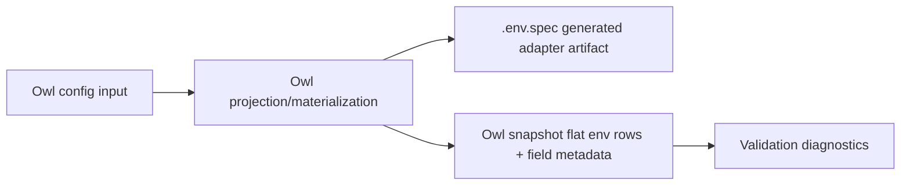

# Composite Requirements

## Goal

Owl should model higher-level environment requirements without making `.env.spec` carry the full semantic model.

The first composite requirement is Redis:

- `host`
- `port`
- `password`

More Redis shape (`username`, `db`, `tls`, URI normalization, sentinel, cluster) is deferred.

Owl also includes provider API client contracts for common LLM integrations:

- `universe/openai`
- `universe/anthropic`

## Flow



## Config Frontend

User-authored requirements use an Owl config input model, not CUE.

CUE remains the format for type definitions and validation internals. Local project config should stay approachable and map to a language-neutral input object.

The preferred standalone local frontend is TOML:

```toml
[needs.redis.queues]
type = "github.com/runmedev/owl/types/universe/redis"

[needs.redis.queues.dotenv]
password = "REDIS_AUTH_TOKEN"
```

See `examples/redis/owl.toml` for a runnable minimal example.

This says the project needs a Redis connection named `queues`.

Required Redis fields not listed under `dotenv` are inferred:

```text
host -> QUEUES_REDIS_HOST
port -> QUEUES_REDIS_PORT
```

Explicit `dotenv` entries override inferred keys:

```text
password -> REDIS_AUTH_TOKEN
```

Owl may also read `owl.yaml`, `owl.yml`, and `owl.json`. All frontends hydrate the same config input model.

Provider API client examples follow the same shape:

```toml
[needs.openai.default]
type = "github.com/runmedev/owl/types/universe/openai"

[needs.openai.default.dotenv]
baseURL = "OPENAI_BASE_URL"
organization = "OPENAI_ORG_ID"
project = "OPENAI_PROJECT_ID"
```

```toml
[needs.anthropic.default]
type = "github.com/runmedev/owl/types/universe/anthropic"

[needs.anthropic.default.dotenv]
baseURL = "ANTHROPIC_BASE_URL"
```

See `examples/openai/owl.toml` and `examples/anthropic/owl.toml` for runnable examples.

Universe examples should use real provider conventions. Custom projection key
behavior is covered by tests and should not be confused with provider defaults.

## Canonical Input Shape

The durable config contract is shaped like GraphQL input types and serializes naturally to JSON:

```graphql
input OwlConfigInput {
  needs: [NeedInput!]!
}

input NeedInput {
  id: String!
  type: ID!
  instance: String!
  dotenv: DotenvProjectionInput
}

input DotenvProjectionInput {
  fields: [DotenvFieldBindingInput!]
}

input DotenvFieldBindingInput {
  field: String!
  key: String!
}
```

JSON representation:

```json
{
  "needs": [
    {
      "id": "redis.queues",
      "type": "github.com/runmedev/owl/types/universe/redis",
      "instance": "queues",
      "dotenv": {
        "fields": [
          { "field": "password", "key": "REDIS_AUTH_TOKEN" }
        ]
      }
    }
  ]
}
```

## Dotenv Projection Rules

If `dotenv` is omitted, Owl creates bindings for every required field in the type definition.

For the default instance:

```toml
[needs.redis.default]
type = "github.com/runmedev/owl/types/universe/redis"
```

Owl infers:

```text
host     -> REDIS_HOST
port     -> REDIS_PORT
password -> REDIS_PASSWORD
```

For named instances, inferred keys use instance-first ordering:

```text
queues.host     -> QUEUES_REDIS_HOST
queues.port     -> QUEUES_REDIS_PORT
queues.password -> QUEUES_REDIS_PASSWORD
```

Rules:

- `type` stays explicit.
- `default` stays explicit.
- inferred bindings include required fields only.
- explicit `dotenv` mappings may name any known field.
- unknown fields are hard errors.
- duplicate dotenv keys are hard errors.
- inferred keys are normalized to uppercase snake case.
- explicit keys are preserved exactly.
- observed keys that are not declared by config or spec remain `core/opaque`;
  Owl does not ambiently promote key names into `universe/*` types during
  snapshot/check.

## Type References

Type references are import-path-like refs that resolve to CUE definitions in a git repo.

Built-in Owl types live in this repo:

```text
github.com/runmedev/owl/types/core/plain
github.com/runmedev/owl/types/core/secret
github.com/runmedev/owl/types/core/url
github.com/runmedev/owl/types/universe/redis
github.com/runmedev/owl/types/universe/openai
github.com/runmedev/owl/types/universe/anthropic
```

An optional `#<git-ref>` suffix can request a branch, tag, or commit-ish:

```text
github.com/runmedev/owl/types/universe/redis#main
github.com/runmedev/owl/types/universe/redis#v0.2.0
github.com/runmedev/owl/types/universe/redis#abc1234
```

The `#<git-ref>` addresses the git repo ref. Owl instance identity stays separate.

Short refs such as `universe/redis`, `universe/openai`, and `universe/anthropic` are accepted as authoring shorthand.

## Schema Package

Owl provides an upstream CUE schema package:

```text
github.com/runmedev/owl/schema
```

It owns common definitions such as:

```cue
#Type
#Field
#Kind
#Visibility
```

Built-in and custom type packages import this schema instead of redefining the contract. Start with an unversioned schema import while the model is internal.

## Type Definition Shape

Each type file carries registry metadata and validation.

Example Redis type:

```cue
package redis

import (
	"net"

	owl "github.com/runmedev/owl/schema"
)

#Redis: owl.#Type & {
	id:          "github.com/runmedev/owl/types/universe/redis"
	kind:        "composite"
	description: "Redis connection configuration"

	fields: {
		host: owl.#Field & {
			type:        "github.com/runmedev/owl/types/core/plain"
			required:    true
			description: "Redis server hostname"
			value:       #RedisHostValue
		}
		port: owl.#Field & {
			type:        "github.com/runmedev/owl/types/core/plain"
			required:    true
			description: "Redis server port"
			value:       uint & >=1 & <=65535
		}
		password: owl.#Field & {
			type:        "github.com/runmedev/owl/types/core/secret"
			required:    true
			description: "Redis password"
			value:       string & !=""
		}
	}
}

#RedisHostnameValue: string & =~"^[A-Za-z0-9](?:[A-Za-z0-9-]{0,61}[A-Za-z0-9])?(?:\\.[A-Za-z0-9](?:[A-Za-z0-9-]{0,61}[A-Za-z0-9])?)*\\.?$" & =~"[A-Za-z]"

#RedisHostValue: net.IP | #RedisHostnameValue
```

Registry/materialization reads `#Redis`. Validation unifies resolved primitive
values with `#Type.value` and composite field values with
`#Type.fields.<field>.value`.

## Generated `.env.spec`

`.env.spec` is generated from Owl config and type metadata. Humans should not maintain it directly when Owl config is present.

```dotenv
# Generated by Owl from owl.toml. Do not edit by hand.

QUEUES_REDIS_HOST="Redis server hostname" # Plain!
QUEUES_REDIS_PORT="Redis server port"     # Plain!
REDIS_AUTH_TOKEN="Redis password"         # Secret!
```

Materialization may overwrite generated `.env.spec` content. It must refuse to overwrite human-maintained `.env.spec` files.

## Field Identity

Store field identity structurally:

```text
TypeID:   github.com/runmedev/owl/types/universe/redis
Instance: queues
Field:    host
```

Display refs are allowed for logs, diagnostics, CLI output, and docs:

```text
universe/redis("queues").host
```

Do not make the display string the storage format.

## Snapshot Shape

Snapshots stay flat first:

```text
QUEUES_REDIS_HOST  literal  universe/redis("queues").host
QUEUES_REDIS_PORT  literal  universe/redis("queues").port
REDIS_AUTH_TOKEN   masked   universe/redis("queues").password
```

Composite rows can be added later as a projection/UI feature.

## Validation

Composite instances can exist while individual fields are unresolved.

Validation should:

1. Resolve env bindings into a typed value shape.
2. Coerce string-carried env values into typed values where needed.
3. Apply primitive field validation.
4. Apply composite value validation.
5. Emit field-level diagnostics.

Example diagnostic:

```text
universe/redis("queues").password: required field is unresolved
```

## Deferred

- Embedded config in `package.json` and `pyproject.toml`.
- Lockfile support for requested refs and resolved repo/path/commit.
- External type registries.
- Redis `username`, `db`, `tls`, URL normalization, sentinel, and cluster.
- Runme integration.
- Public GraphQL API.
